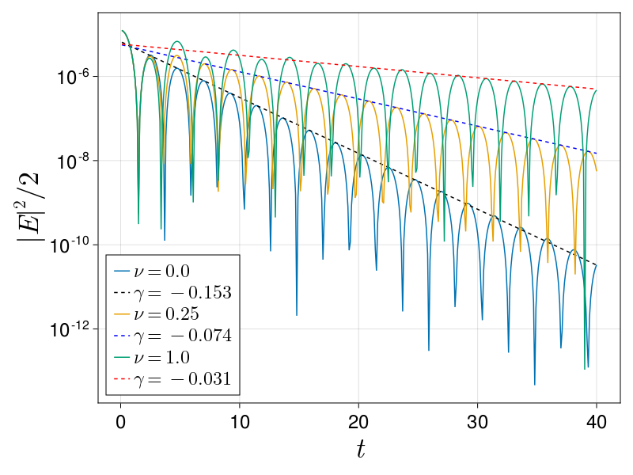

# DispersionRelations

DispersionRelations.jl is a small package for estimating linear dispersion relations from data.
It is intended for use in computational physics, where it is often necessary to compare the
measured growth rate of some instability or damping process to linear theory.

The package consists of two functions:
- `fit_pure_growth_rate(t, E, time_range)`, which fits `E` as a purely growing exponential function of `t`.
  This function uses a very simple least-squares method to estimate `log.(E) ≈ γ * t + log(E₀)`.
  It is up to the user to supply the time range over which the growth looks linear.
- `fit_complex_frequency(t, E)`, which fits an exponential with complex frequency `ω`.
  The correct way to estimate a complex dispersion relation is by skimming just the peaks
  of the trace on a log plot. Thus, this function is slightly more involved--it must first 
  find the "best" set of peaks, and then perform a linear fit of both growth rate and real
  frequency.

*Estimating collisional Landau damping rates with `fit_complex_frequency`*
